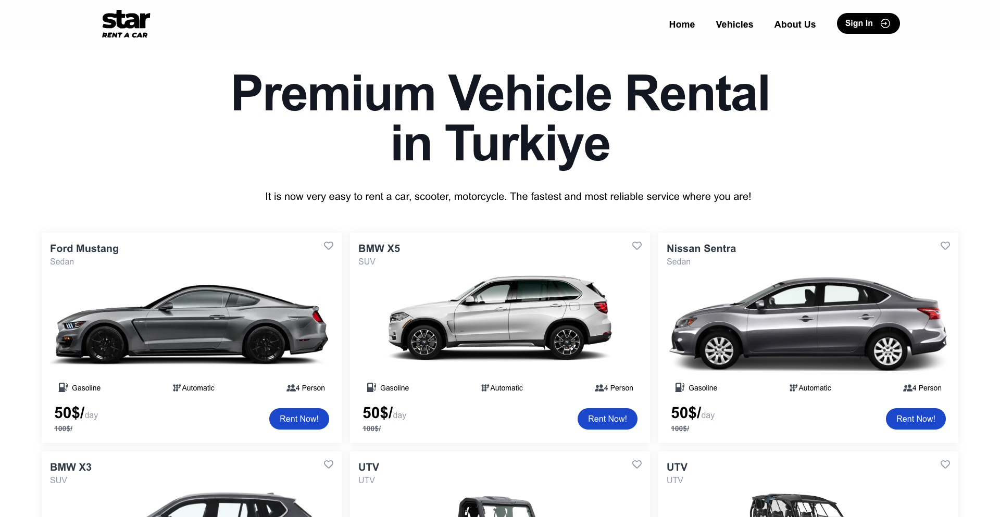
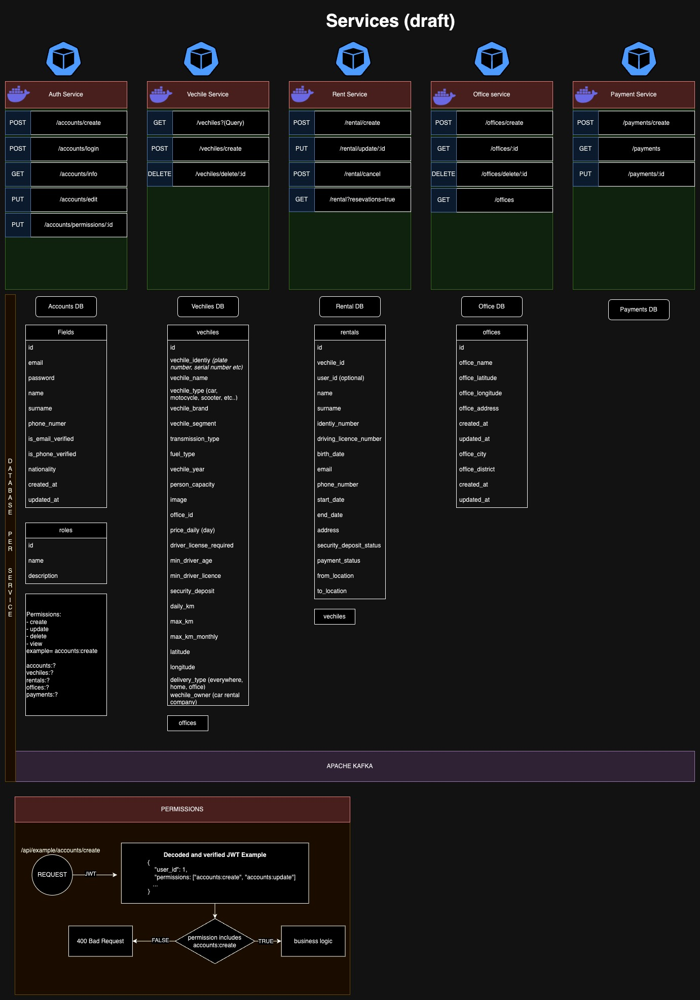

## Star Rent A Car Microservice Architecture

#### Used Technologies (or will be used)

- Docker
- Kubernetes
- Apache Kafka (for EDD)
- Typescript, NestJS, NextJS, JAVA (Spring Boot), PHP
- MongoDB, PostgreSQL, Redis

---

### Services

- <a href="./accounts-service/">Accounts Service</a>
  - Nest.JS, MongoDB
- <a href="./vehicle-service/">Vehicle Service</a>
  - Java (Spring Boot), PostgreSQL





### K8S Secrets

- Create a JWT Secret

```sh
kubectl create secret generic jwt-secret --from-literal=JWT_KEY=1a2b3c4d
```
